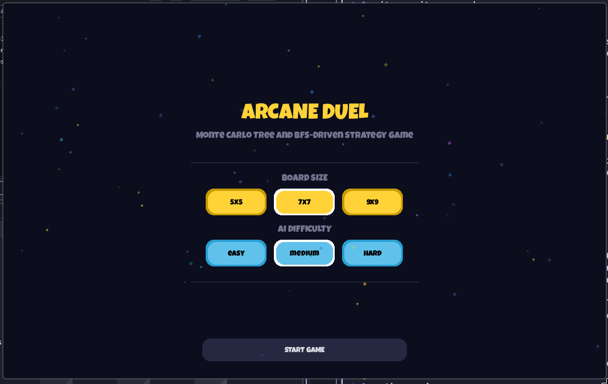
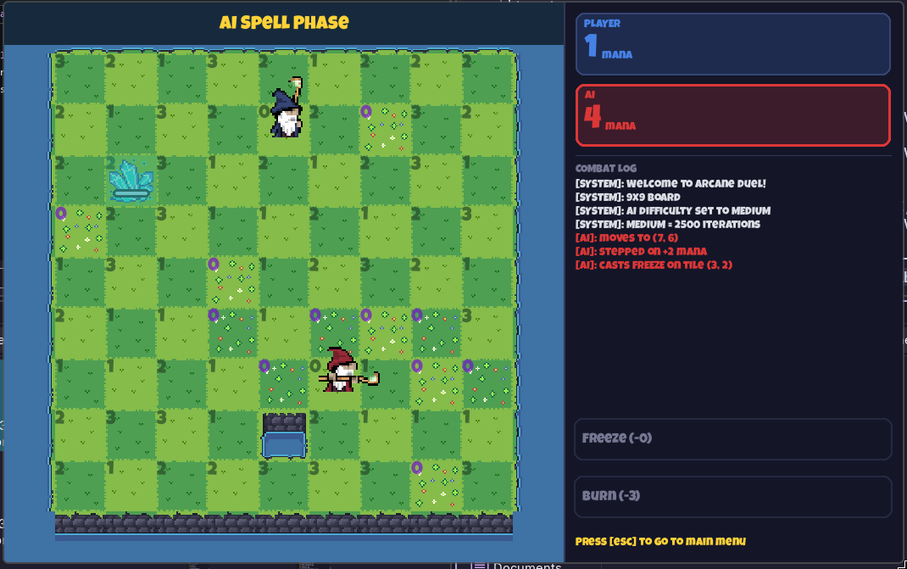

# Arcane Duel

**Monte Carlo Tree Search and BFS-Driven Strategy Game**

Developed in partial fulfillment for COSC 304 – Introduction to Artificial Intelligence
Polytechnic University of the Philippines, College of Computer and Information Sciences

**Group 3 (Members):**
- Binas, John Benedict S.
- Boquiren, Zyryl R.
- Pabillo, Kenneth D.
- Yap, Richard David D.

---



---

## Table of Contents

1. [About](#about)
2. [Gameplay](#gameplay)
3. [Rules](#rules)
4. [Spells](#spells)
5. [Victory Lap and Winning](#victory-lap-and-winning)
6. [AI Implementation](#ai-implementation)
7. [Project Structure](#project-structure)
8. [Installation](#installation)
9. [Running the Game](#running-the-game)
10. [Controls](#controls)
11. [Screenshots](#screenshots)
12. [Development Tools](#development-tools)
13. [References](#references)

---

## About

Arcane Duel is a two-player grid strategy game inspired by the classic move-and-delete mechanics of Isola. Two mages are transported to opposite ends of a field of Floating Isles, each tile pulsing with mana, raw magical energy drawn from the land itself. Every step a mage takes drains the isle they leave behind, sending it into the abyss below. The battlefield shrinks with every move. The duel ends when one mage runs out of ground to stand on, but victory is not simply about surviving. The mage who absorbs the most mana from the land wins, even if their opponent still has possible moves.

---

## Gameplay

The game is played between a human player (Blue Mage) and an AI opponent (Red Mage). The objective is to finish the game with the highest total mana score. Each turn consists of exactly two mandatory phases completed in order: a Movement Phase and a Spell Phase.

The board can be configured as a 5x5, 7x7, or 9x9 grid. The player starts at the top-middle tile and the AI starts at the bottom-middle tile. The starting turn is randomized between the two at the beginning of each game.

---

## Rules

### Board Setup

- The board is a 5x5, 7x7, or 9x9 grid of floating island tiles.
- Every tile holds a mana value, except for the two starting positions which hold zero mana.
- There are two tile types:
  - **Standard Mana Tile** - assigned a fixed random mana value from 1 to 3 at the start of the game.
  - **Cumulative Mana Tile** - starts at 0 mana and has a 15% chance of incrementing by 1 after each full round, capped at a maximum of 5 mana. These are visually distinguishable on the board.


### Movement Phase

The player moves their mage exactly one tile in any direction (vertical, horizontal, or diagonal) to an adjacent active tile. The following restrictions apply:

- You may only move onto active tiles.
- You cannot move onto tiles that are burned, frozen, or occupied by the opponent.
- Once you move to a new tile, its mana value is added to your score.
- The tile you vacated permanently falls into the abyss and is removed from the board.

### Spell Phase

After moving, the player must cast one spell. The spell targets any tile that lies in a straight or diagonal line from the mage's current position, with infinite range. The following restrictions apply:

- You cannot target a tile that is occupied by either player.
- You cannot target past a tile that is blocked by ice (the frozen tile itself can be targeted).
- A spell must be cast every turn. It cannot be skipped.

---

## Spells

| Spell | Effect | Mana Cost | Special Cases |
|-------|--------|-----------|---------------|
| Burn | Permanently removes the targeted tile from the board. The tile grants no mana to either player. | Deducts 3 mana from the caster | Casting Burn on a frozen tile melts the ice and returns the tile's original mana value to the caster instead of destroying it permanently. |
| Freeze | Makes the targeted tile impassable for 6 turns. After 6 turns the tile returns to its normal active state. | Free (no mana cost) | A frozen tile cannot be frozen again until it has fully melted or been burned. |


---

## Victory Lap and Winning

When a mage has no valid adjacent tiles at the start of their turn, their opponent enters the Victory Lap. The surviving mage does not take a normal turn. Instead, the BFS algorithm immediately visits all tiles still reachable from the surviving mage's position and adds the total mana of those tiles to their score.

Once the Victory Lap is complete, the final scores are compared:

- The player with the higher mana total wins.
- If both players have equal mana, the game ends in a draw.


---

## AI Implementation

### Monte Carlo Tree Search (MCTS)

MCTS drives every decision the Red Mage makes. Rather than exhaustively evaluating all possible futures, it focuses computation on the most promising lines of play by iterating through four phases repeatedly:

1. **Selection** - Traverse the tree from the root using the UCB1 formula to choose child nodes, until a node with unexplored actions is reached.
2. **Expansion** - Add one new child node for a randomly chosen untried action.
3. **Simulation** - Play out a random rollout from the new node until no moves remain, then evaluate the resulting board state using the scoring heuristic.
4. **Backpropagation** - Propagate the simulation score up to the root, updating visit counts and cumulative values on every ancestor node.

After all iterations are complete, the child of the root node with the most visits is selected as the AI's action for that turn.

The UCB1 formula balances exploitation and exploration:

```
UCB1 = (node.value / node.visits) + C * sqrt(log(parent.visits) / node.visits)
```

Where C = 1.41 (square root of 2). Unvisited nodes return infinity to force exploration.

#### Difficulty Levels

| Difficulty | MCTS Iterations |
|------------|----------------|
| Easy | 1,000 |
| Medium | 2,500 |
| Hard | 5,000 |

MCTS runs in a background daemon thread so the game UI does not freeze while the AI is thinking.

### Breadth-First Search (BFS)

BFS is used in two contexts:

**Inside MCTS (simulation scoring):** After each rollout, BFS runs from both the AI and player positions to calculate the total reachable mana and tile count for each side. The simulation score is computed as:

```
Score = Mana Score + Territory Score + Isolation Bonus
```

| Component | Formula | Purpose |
|-----------|---------|---------|
| Mana Score | (AI mana + AI reachable mana) - (Player mana + Player reachable mana) | Rewards mana advantage |
| Territory Score | (AI reachable tiles - Player reachable tiles) * 1.5 | Rewards board control |
| Isolation Bonus | max(0, 4 - player_valid_moves) * 3.0 | Rewards cornering the player |

**Victory Lap:** When either player is trapped, BFS visits all tiles reachable from the surviving mage's position and sums their mana values to calculate the final Victory Lap score addition.


---

## Project Structure

```
arcane-duel/
├── main.py
├── ai/
│   ├── bfs.py               # BFS algorithm for MCTS simmulation and Victory Lap
│   ├── mcts.py              # MCTS algorithm with best action function
│   └── mcts_node.py         # MCTS tree node definition
├── core/
│   ├── board.py             # Board state, tile grid, and spell/move application
│   ├── enums.py             # Enumerations for game states, tile types, spells
│   ├── game.py              # Main game loop, turn management, phase logic
│   ├── mage.py              # Mage entity, position, and animation state
│   └── tile.py              # Tile class, mana values, freeze/burn state
├── graphics/
│   ├── animation.py         # Base animation class
│   ├── fire_anim.py         # Burn spell animation
│   ├── freeze_anim.py       # Freeze spell animation
│   ├── move_anim.py         # Mage movement animation
│   ├── platform_sprite.py   # Tile platform sprite rendering
│   ├── spritesheet.py       # Spritesheet loading utility
│   ├── tile_destroy_anim.py # Tile destruction animation
│   └── transition.py        # Screen transition effects
├── ui/
│   ├── board_display.py     # Game board rendering
│   ├── flash_display.py     # Turn and phase announcement overlays
│   ├── game_over_display.py # Win, lose, and draw result screen
│   ├── main_menu_display.py # Main menu with board size and difficulty selection
│   ├── panel_display.py     # Side panel for mana scores, spells, and combat log
│   └── util.py              # Shared UI utility functions
├── assets/                  # Sprite sheets, tile images, fonts
└── docs/                    # Screenshots and documentation 
```

---

## Installation

**Requirements:** Python 3.8 or higher

**Step 1.** Clone the repository:
```
git clone https://github.com/ken85illo/arcane-duel.git
cd arcane-duel
```

**Step 2.** Create a virtual environment:
```
python -m venv venv
```

**Step 3.** Activate the virtual environment:

Windows:
```
venv\Scripts\activate.bat
```

macOS / Linux:
```
source venv/bin/activate
```

**Step 4.** Install dependencies:
```
pip install pygame-ce
```

---

## Running the Game

From the project root directory:

```
python main.py
```

---

## Controls

| Input | Action |
|-------|--------|
| Left Click | Select a movement tile or confirm a spell type and target |
| R | Restart the game from the Game Over screen |
| Esc | Return to the main menu |

---

## Screenshots

### Main Menu


### Game Board




---

## Development Tools

| Library | Purpose |
|---------|---------|
| pygame-ce | Game rendering, input handling, animations, and the main event loop |
| math | Provides `math.sqrt` and `math.log` used in the UCB1 formula |
| random | Random tile mana generation, cumulative tile increments, and MCTS rollout sampling |
| threading | Runs MCTS in a background daemon thread parallel to the game draw loop |
| queue | Queue data structure used in the BFS implementation |

---

## References

Russell, S. J., & Norvig, P. (2021). *Artificial Intelligence: A Modern Approach* (4th ed.). Pearson.

Radke, P. (2023). Monte Carlo Tree Search: A Guide. Builtin. https://builtin.com/machine-learning/monte-carlo-tree-search

TomRocksMaths (n.d.). The Mathematics Behind the Monte Carlo Tree Search Algorithm. https://tomrocksmaths.com/wp-content/uploads/2023/06/monte-carlo-tree-search-algorithm-essay.pdf

Winands, M. (n.d). Monte-Carlo Tree Search. https://dke.maastrichtuniversity.nl/m.winands/documents/Encyclopedia_MCTS.pdf
